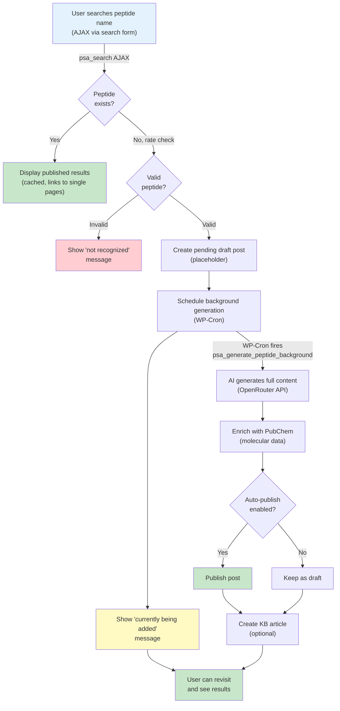
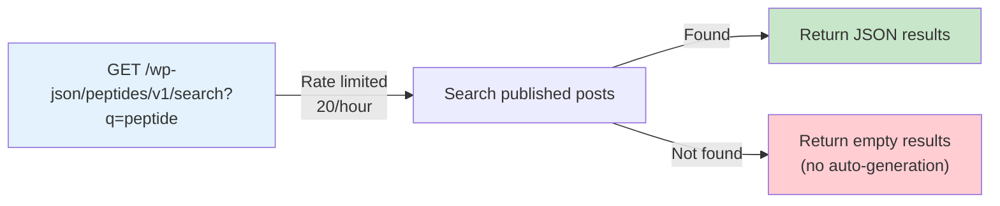
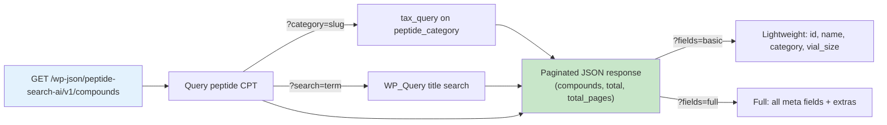
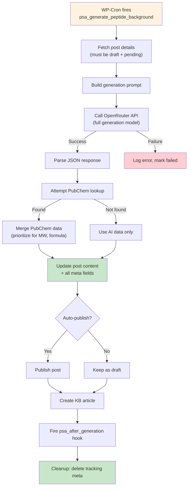

# Peptide Search AI — Architecture

## Overview

Peptide Search AI is a WordPress plugin that transforms sites into intelligent, self-growing peptide databases. Visitors search for peptides using an AJAX search form—if a result exists, it displays instantly; if not, the plugin automatically validates the peptide name via lightweight AI, creates a placeholder post, and queues comprehensive content generation in the background via WP-Cron. The generated entry includes molecular data, mechanism of action, research applications, safety profiles, and PubChem cross-reference enrichment. All functionality is non-blocking, respects rate limits, and supports multiple search instances on a single page.

## File Tree

```
peptide-search-ai/
├── peptide-search-ai.php              Main plugin file; defines constants, hooks init/admin_init
├── uninstall.php                      Cleans up all peptide posts, meta, options, transients
├── readme.txt                         Plugin directory listing (WordPress.org metadata)
├── composer.json                      PHP dependencies; PSR-4 autoloader for includes/
├── .phpcs.xml.dist                    WordPress Coding Standards (WPCS) configuration
├── .gitignore                         Excludes vendor, node_modules, IDE files
│
├── includes/
│   ├── class-psa-config.php           Configuration constants (rate limits, timeouts, tokens, TTL)
│   ├── class-psa-encryption.php       AES-256-CBC encryption for API keys at rest
│   ├── class-psa-post-type.php        CPT registration, peptide_category taxonomy, meta field definitions
│   ├── class-psa-search.php           AJAX search, REST API route, shortcode rendering, cache mgmt
│   ├── class-psa-directory.php        Browsable directory: [peptide_directory] shortcode + /v1/compounds REST endpoint
│   ├── class-psa-ai-generator.php     AI pipeline orchestrator (validation, generation, category assignment, meta save)
│   ├── class-psa-openrouter.php       OpenRouter API HTTP layer (retry, rate limit, response parsing)
│   ├── class-psa-kb-builder.php       Echo Knowledge Base article builder from AI data
│   ├── class-psa-cost-tracker.php     API usage logging, monthly budget enforcement, cost estimation
│   ├── class-psa-pubchem.php          PubChem PUG REST API integration for molecular enrichment
│   ├── class-psa-admin.php            Settings page, usage dashboard, migration tools, re-enrichment actions
│   └── class-psa-template.php         Single peptide page rendering; quick-facts, extended data, badges
│
├── assets/
│   ├── js/
│   │   ├── peptide-search.js          Frontend search, AJAX handler, result rendering (jQuery)
│   │   └── psa-directory.js           Directory grid, category filters, detail modal (vanilla JS)
│   └── css/
│       ├── peptide-search.css         Scoped styles for search UI, results, pending states, badges
│       └── psa-directory.css          Directory card grid, filter pills, modal styles, dark mode support
│
└── .github/workflows/
    ├── ci.yml                         PHP lint, PHPCS, JS syntax checks on PR/push
    └── deploy.yml                     Pre-deploy validation, orphan deploy branch sync, SSH deploy
```

## Data Flow



### REST API Flow



### Directory REST API Flow (v4.3.0)



### Background Generation Flow



## External API Integrations

### OpenRouter (AI Generation & Validation)

**Purpose:** Access hundreds of language models (Gemini, Llama, Mistral, DeepSeek, Qwen, etc.) for peptide validation and full content generation.

**Code Locations:**
- **Validation:** `includes/class-psa-ai-generator.php` → `PSA_AI_Generator::validate_peptide_name()` (lines 32–90)
  - Uses fast, cheap validation model (default: `google/gemini-2.0-flash-001`)
  - Prompt: `PSA_AI_Generator::build_validation_prompt()` (validates peptide name only)
  - Transient cache: 24 hours to avoid repeated API calls
  
- **Full Generation:** `includes/class-psa-ai-generator.php` → `PSA_AI_Generator::generate_peptide_content()` (lines 196–220)
  - Uses capable generation model (default: `google/gemini-2.5-flash`)
  - Prompt: `PSA_AI_Generator::build_generation_prompt()` (full JSON structure)
  - Max tokens: 4096
  - Called via WP-Cron (non-blocking)

- **API Call:** `includes/class-psa-openrouter.php` → `PSA_OpenRouter::send_request()`
  - Endpoint: `https://openrouter.ai/api/v1/chat/completions`
  - Requires API key: database `psa_settings['api_key']` or constant `PSA_OPENROUTER_KEY`
  - Retry logic: 3 retries with exponential backoff (5s base delay)
  - Response parsing via `PSA_OpenRouter::parse_response()` (strips think tags, code fences)

- **KB Article Creation:** `includes/class-psa-kb-builder.php` → `PSA_KB_Builder::create_article()`
  - Creates Echo Knowledge Base articles from AI-generated data
  - Builds structured HTML with h2/h3 headings, category assignment
  - Cross-references peptide post ↔ KB article via post meta

**Configuration:** `Settings > Peptide Search AI` in WordPress admin
- API Key field (or via `PSA_OPENROUTER_KEY` in wp-config.php for security)
- Generation Model input (leave blank for default)
- Validation Model input (leave blank for default)

### PubChem PUG REST API

**Purpose:** Verify molecular data (weight, formula, SMILES, InChI) for generated peptides to ensure scientific accuracy.

**Code Location:** `includes/class-psa-pubchem.php`

- **Lookup Entry:** `PSA_PubChem::lookup()` (lines 23–74)
  - Checks if enabled via setting `use_pubchem`
  - Caches results: not found (12h), success (7d), errors (1h)
  
- **CID Lookup:** `PSA_PubChem::get_cid_by_name()` (lines 82–107)
  - Endpoint: `https://pubchem.ncbi.nlm.nih.gov/rest/pug/compound/name/{name}/cids/JSON`
  - Returns PubChem Compound ID
  
- **Properties Fetch:** `PSA_PubChem::get_properties()` (lines 115–151)
  - Endpoint: `https://pubchem.ncbi.nlm.nih.gov/rest/pug/compound/cid/{cid}/property/[list]/JSON`
  - Extracts: molecular formula, weight, IUPAC name, SMILES, InChI

**Integration:** In `PSA_AI_Generator::background_generate()` (lines 143–152)
- Calls PubChem after AI generation completes
- Merges results in `save_peptide_meta()` (lines 263–268): PubChem molecular data takes precedence
- Stores PubChem CID in post meta (`psa_pubchem_cid`)
- Sets source badge to `'pubchem'` if data found, `'ai-generated'` otherwise

**Configuration:** `Settings > Peptide Search AI` → "PubChem Enrichment" checkbox

## Key Architectural Decisions

### 1. Custom Post Type + Post Meta vs. Custom Tables

**Decision:** Use CPT (`post_type='peptide'`) with post meta fields (`psa_*`).

**Rationale:**
- **WordPress integration:** Leverage native post, user, revision, and permission systems.
- **Revisions & history:** Posts automatically support edit history; rollback is trivial.
- **Ecosystem:** Works with WP REST API, WP-CLI, backup/migration plugins without custom code.
- **Scalability:** Post meta queries are indexed and optimized; joins across postmeta are standard WP practice.
- **Admin UX:** Native post editor, meta boxes, publish workflow familiar to non-technical users.

### 2. WP-Cron for Background Generation

**Decision:** Use `wp_schedule_single_event()` and `spawn_cron()` for non-blocking generation.

**Rationale:**
- **Non-blocking:** User gets "pending" response immediately; server doesn't wait for AI API calls.
- **Reliability:** WP-Cron integrates with WordPress; admin can reschedule failed tasks via hooks.
- **Cost control:** AI API calls happen in background; can rate-limit globally via daily cap (50/day).
- **Simplicity:** No external job queue infrastructure (Redis, RabbitMQ) required.

**Trade-off:** WP-Cron triggers only when site receives traffic; if silent periods occur, delayed execution possible.

### 3. OpenRouter as AI Provider

**Decision:** Use OpenRouter API instead of single model (e.g., OpenAI only) or self-hosted LLM.

**Rationale:**
- **Model flexibility:** Users can choose cheap/fast models for validation (Gemini Flash, Llama Scout) or high-quality models for generation (Gemini, Llama, DeepSeek).
- **Cost optimization:** Separate validation model (cheaper) from generation model (better quality).
- **No vendor lock-in:** Switch models without code changes.
- **Reduced CORS/auth complexity:** Single API key, consistent endpoint.

**Trade-off:** Depends on third-party SaaS; requires API key management and cost monitoring.

### 4. Orphan Deploy Branch

**Decision:** CI/CD creates an orphan `deploy` branch containing only production-ready files (assets, includes, main plugin file, readme.txt).

**Rationale:**
- **Clean deployment:** Development files (CI scripts, docs, tests) don't ship to production.
- **Hostinger deployment:** SSH-based git pull simplicity; can reset to `origin/deploy` without merge conflicts.
- **Security:** `.env`, `.github/workflows`, `composer.json` stay in dev; never push secrets.
- **Staging safety:** Deploy branch is immutable until main passes all CI checks.

**Implementation:** `.github/workflows/deploy.yml` (lines 110–145) checks out main, removes all files, then re-adds only whitelisted files, commits, and pushes to deploy branch.

### 5. Transient Caching

**Decision:** Use WordPress transients for validation results, search cache, rate limits, and PubChem lookups.

**Rationale:**
- **Simple API:** `get_transient()`, `set_transient()` with TTL is trivial compared to cache frameworks.
- **No schema:** Transients auto-expire; no cleanup scripts required.
- **Respects site config:** Uses WordPress-configured cache backend (database, Redis, memcached, etc.).
- **Rate limit tracking:** Each client IP stored as transient with 1-hour TTL per PSA_Config.

**TTLs in use:**
- Validation cache: 24 hours (avoid repeated AI calls for same peptide name)
- Search cache: 6 hours (invalidated on post save)
- PubChem cache: 7 days for hits, 12 hours for misses
- Rate limit counters: 1 hour per request window

## Data Storage

### Post Meta Fields (PSA_Post_Type::META_FIELDS)

All stored on peptide posts as post meta:

| Key | Label | Type | Source |
|-----|-------|------|--------|
| `psa_sequence` | Amino Acid Sequence | Text | AI |
| `psa_molecular_weight` | Molecular Weight | Text | PubChem (preferred) or AI |
| `psa_molecular_formula` | Molecular Formula | Text | PubChem (preferred) or AI |
| `psa_aliases` | Aliases / Synonyms | Text | AI |
| `psa_mechanism` | Mechanism of Action | Text | AI |
| `psa_research_apps` | Research Applications | Text | AI |
| `psa_safety_profile` | Safety & Side Effects | Text | AI |
| `psa_dosage_info` | Dosage Information | Text | AI |
| `psa_references` | References & Citations | Text | AI |
| `psa_source` | Data Source (badge) | Enum: `ai-generated\|pubchem\|manual\|pending\|failed` | System |
| `psa_pubchem_cid` | PubChem Compound ID | Integer | PubChem |
| `psa_generation_started` | Generation start timestamp | Unix timestamp | System (temporary, deleted on completion) |
| `psa_generation_attempts` | Retry counter | Integer | System (temporary) |
| `psa_generation_error` | Error message (if generation failed) | Text | System (temporary) |
| `psa_generation_completed` | Generation completion timestamp | Unix timestamp | System |
| `psa_half_life` | Half-life display (e.g., "~4-6 hours") | Text | AI (v4.3.0) |
| `psa_stability` | Stability info (e.g., "28 Days at 2°C") | Text | AI (v4.3.0) |
| `psa_solubility` | Reconstitution solvent | Text | AI (v4.3.0) |
| `psa_vial_size_mg` | Common vial size in mg | Float | AI (v4.3.0) |
| `psa_storage_lyophilized` | Storage conditions (powder) | Text | AI (v4.3.0) |
| `psa_storage_reconstituted` | Storage conditions (solution) | Text | AI (v4.3.0) |
| `psa_typical_dose_mcg` | Typical research dose range | Text | AI (v4.3.0) |
| `psa_cycle_parameters` | Cycle/protocol phase info | Text | AI (v4.3.0) |
| `psa_amino_acid_count` | Number of amino acids | Integer | Derived from sequence (v4.3.0) |

### Taxonomy: peptide_category (v4.3.0)

Hierarchical taxonomy registered on the `peptide` CPT. Pre-populated terms:
Tissue Repair, Lipid Metabolism, Aging Research, Dermatological, Metabolic, Growth Hormone, Immunology, Endocrine.

Auto-assigned during AI generation via `PSA_AI_Generator::assign_category_term()`.
Migration for existing peptides via admin "Migrate Existing Peptides to Categories" button.

### Integration Hooks (v4.3.0)

| Hook | Type | Description |
|------|------|-------------|
| `psa_after_peptide_detail` | Action | Fired when a single peptide is rendered (single page or modal). Receives `$post_id`. |
| `psa_directory_card_extras` | Filter | Allows adding HTML to directory cards (e.g., observation count badge). |
| `psa_rest_compound_data` | Filter | Allows enriching REST compound data before response. Receives `$data`, `$post_id`. |

### Options (Plugin Settings)

Stored in `wp_options` table:

```php
$psa_settings = array(
    'api_key'          => 'sk-...', // OpenRouter API key (or use PSA_OPENROUTER_KEY constant)
    'ai_model'         => 'google/gemini-2.5-flash', // Full generation model
    'validation_model' => 'google/gemini-2.0-flash-001', // Lightweight validation model
    'auto_publish'     => 'draft|publish', // Auto-publish strategy
    'use_pubchem'      => '1|0', // Enable PubChem enrichment
);
```

## Frontend Architecture

### JavaScript (jQuery-based)

**File:** `assets/js/peptide-search.js` (214 lines)

- **Multiple instances:** Each `[peptide_search]` shortcode gets a unique instance scoped to `.psa-search-wrap` container.
- **AJAX handler:** `initSearchInstance()` (lines 20–204) manages form submission, input events, result rendering.
- **Debouncing:** Input changes debounced 400ms to avoid excessive AJAX calls.
- **Response handling:**
  - `status: 'found'` → render results with title, molecular data, source badge, excerpt, link to single page
  - `status: 'pending'` → show "currently being added" message
  - `status: 'invalid'` → show "peptide not recognized" message
  - `status: 'rate_limited'` → show rate limit error
- **Error handling:** Network, timeout, server errors caught and displayed to user.

### CSS (BEM-inspired class structure)

**File:** `assets/css/peptide-search.css` (388 lines)

- **Prefix:** All classes prefixed `.psa-` (Peptide Search AI) to avoid conflicts.
- **Search form:** `.psa-search-input-wrap`, `.psa-search-input`, `.psa-search-btn`
- **Results:** `.psa-result-item`, `.psa-result-title`, `.psa-result-meta`, `.psa-result-badge`
- **States:** `.psa-checking`, `.psa-pending`, `.psa-invalid`, `.psa-error`
- **Single page:** `.psa-peptide-data`, `.psa-quick-facts`, `.psa-facts-table`, `.psa-source-badge`
- **Responsive:** Mobile breakpoint at 600px for touch-friendly search and collapsed table layout.
- **Colors:** Blue (`#2563eb`) for primary actions, green for verified, yellow for AI-generated, blue for manual.

### Shortcode Rendering

**Location:** `PSA_Search::render_search_form()` (lines 117–162 in class-psa-search.php)

- Instance counter ensures unique `data-psa-instance` attributes on multiple shortcodes.
- Form structure: input + submit button in flex container.
- Result containers pre-rendered (hidden) for AJAX population.
- ARIA attributes for accessibility: `role="search"`, `aria-live="polite"`, `aria-busy` toggle.

### Asset Loading

**Location:** `psa_maybe_enqueue_assets()` in main plugin file (lines 63–86)

- Conditional: load only on:
  - Front page (hero search)
  - KB page (page ID 73 or slug `peptide-database`)
  - Posts/pages containing `[peptide_search]` shortcode
  - Single peptide pages (`is_singular('peptide')`)
- Script localization: `psaAjax` object with `ajaxurl` and nonce injected to frontend.

## Security Considerations

- **CSRF:** All AJAX calls include nonce verification (`psa_search_nonce`).
- **Rate limiting:** IP-based transient tracking; AJAX (10/hour), REST API (20/hour).
- **API key:** Stored in options table (fallback) or wp-config.php constant `PSA_OPENROUTER_KEY` (preferred).
- **Sanitization:** All user inputs sanitized via `sanitize_text_field()`, `wp_unslash()`, `wp_kses_post()`.
- **Peptide name validation:** Pre-AI-call character validation blocks obvious injection attempts.
- **SQL injection:** All database queries use `wpdb->prepare()` with placeholders.
- **Output escaping:** HTML output escaped via `esc_html()`, `esc_attr()`, `esc_url()`.

## Performance Optimizations

- **Post caching:** `_prime_post_caches()` and `update_meta_cache()` batch-load posts and meta (lines 458–459 in class-psa-search.php).
- **Transient caching:** Search results cached 6 hours; invalidated on post save.
- **Conditional asset loading:** CSS/JS only loaded on relevant pages.
- **Lazy PubChem:** Optional, can be disabled via setting.
- **Daily generation cap:** 50/day to limit API costs.
- **Separate validation model:** Fast/cheap model for upfront validation to reduce full-generation calls.

## Testing

**CI Pipeline:** `.github/workflows/ci.yml`
- PHPUnit tests across PHP 7.4, 8.1, 8.3
- PHP syntax checks across PHP 7.4, 8.1, 8.3
- WordPress Coding Standards (PHPCS) validation
- JavaScript syntax checks (Node.js)

**Post-Deploy:** `.github/workflows/deploy.yml`
- HTTP health check verifies site returns 200
- REST API smoke test verifies `/wp-json/peptides/v1/search?q=BPC-157` responds

**Manual Testing Checklist:**
- Search for existing peptide → results appear
- Search for new peptide (valid) → "pending" message → check back → content generated
- Search for invalid peptide → "not recognized" message
- Test rate limits (10/hour AJAX, 20/hour REST API)
- Verify PubChem data merges correctly
- Test auto-publish on/off
- Verify shortcode works multiple times on same page
- Test on mobile (600px breakpoint)

## Deployment

See `.github/workflows/deploy.yml`:
1. Push to main triggers CI tests.
2. If tests pass, validate deployment readiness (required files, no sensitive data).
3. Sync clean files to orphan `deploy` branch.
4. SSH to Hostinger, git pull `deploy` branch into plugin directory.
5. Verify deployment (check version, required files exist).
